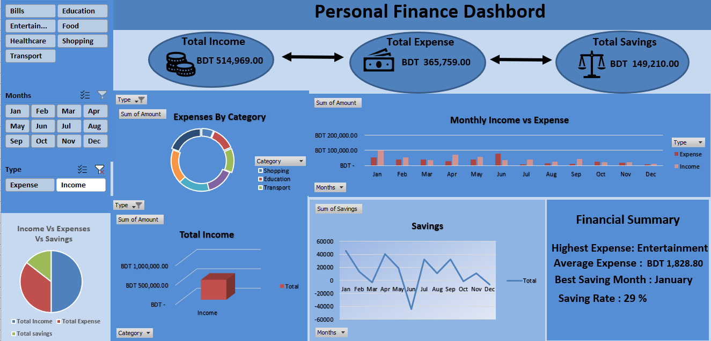

# 📊 Personal Finance Dashboard in Excel

A beginner-friendly Excel dashboard project built to analyze personal financial data using formulas, Pivot Tables, Pivot Charts, KPI Cards, and interactive slicers.

## Project Overview

This project transforms raw financial transaction data into an interactive dashboard that provides insights into:

* Total Income
* Total Expenses
* Total Savings
* Expense by Category
* Monthly Income vs Expense
* Monthly Savings Trends

The dashboard is designed to help users understand their financial activities through visualizations and summarized reports.

## Dashboard Preview



## Features

* Data Cleaning and Organization
* Excel Tables
* SUMIF Formula
* TEXT Formula
* Pivot Tables
* Pivot Charts
* Interactive Slicers
* KPI Cards
* Dashboard Design

## Tools Used

* Microsoft Excel
* Pivot Tables
* Pivot Charts
* SUMIF
* TEXT
* Slicers
* Dashboard Design Techniques

## Project Structure

```text
.
├── images/
│   └── Dashboard_Preview.png
├── Personal_Finance_Dashboard.xlsx
└── README.md
```

## Learning Objectives

This project was created to practice and demonstrate:

* Data Cleaning
* Formula Applications
* Data Summarization
* Data Visualization
* Dashboard Development
* Financial Data Analysis

## Getting Started

1. Download the Excel file.
2. Open it using Microsoft Excel.
3. Explore the dashboard using the slicers and filters.
4. Analyze income, expenses, and savings trends.

## Blog Post

A detailed walkthrough explaining how this dashboard was built is available on Medium.

## Author

**Susmita Saha**

Business Administration Student | Excel Learner | Aspiring Data Analyst
